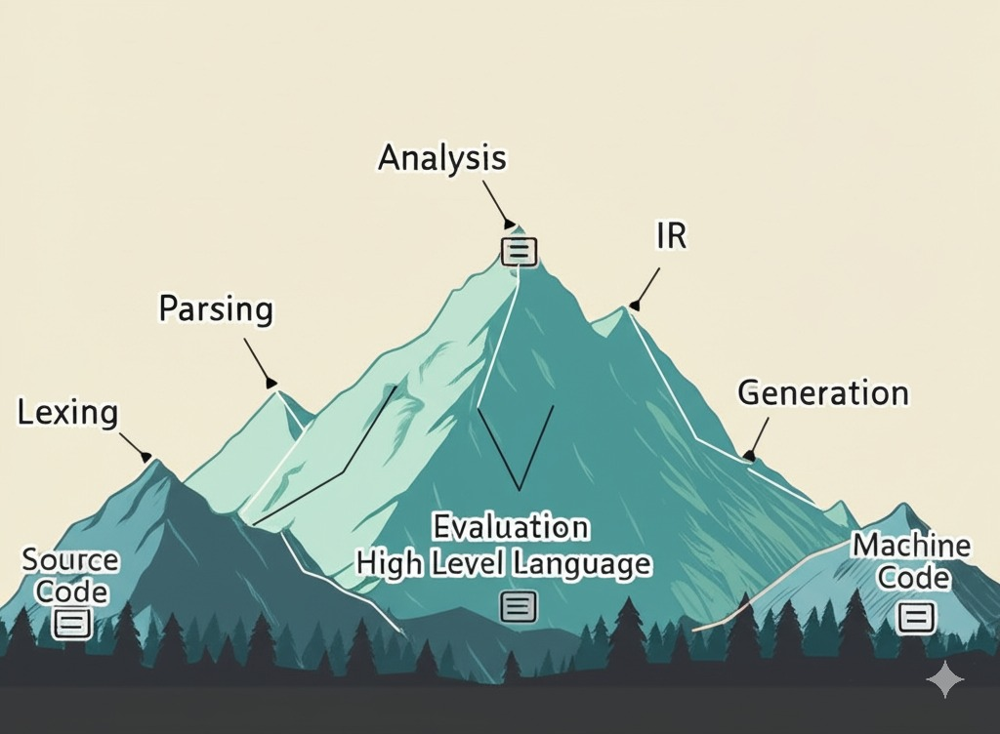

# MyProgrammingLanguage



This repository contains an implementation of a custom programming language. The goal is to develop a full-featured language with its own syntax, semantics, and runtime.

The project includes a lexer, parser, analyzer, generator, and evaluator. The lexer breaks the source code into tokens based on the language grammar, the parser generates an Abstract Syntax Tree (AST) representing the program structure, the analyzer performs semantic analysis and type checking, the generator transpiles the code to Java, and the evaluator executes the AST to produce program output.

## Key Components

### Lexer
- Hand-written scanner that tokenizes source code according to language rules
- Recognizes keywords, identifiers, literals, and operators
- Produces a stream of typed tokens with position information

### Parser
- Hand-written recursive descent parser
- Transforms token stream into a structured AST
- Handles expressions, statements, function definitions, and control flow
- Supports optional type annotations for variables and functions

### Analyzer
- Performs static semantic analysis on the AST
- Implements type checking and ensures type safety
- Validates variable and function declarations and usages
- Ensures proper scoping and variable resolution
- Verifies that operations are performed on compatible types
- Catches semantic errors before execution

### Generator
- Transpiles the validated AST to Java source code
- Handles translation of language constructs to equivalent Java code
- Supports hoisting of declarations to meet Java requirements
- Manages appropriate type conversions and method calls
- Produces executable Java program that preserves language semantics

### Evaluator
- Implements the visitor pattern to traverse and evaluate the AST
- Supports dynamic typing and first-class functions
- Manages lexical scoping and environment frames
- Handles runtime error detection and reporting

## Language Features

### Data Types
- Dynamic typing with runtime type checking
- Optional static type annotations for compile-time validation
- Primitive values: booleans, integers (`BigInteger`), decimals (`BigDecimal`), strings, and nil
- Composite types: functions and objects
- Lists (through the native `list` function)
- Type hierarchy with subtypes (Any, Equatable, Comparable, Iterable)

### Variables and Scoping
- Lexical (static) scoping with proper closure behavior
- Block-level variable declarations
- Variable shadowing between scopes
- Mutable variables and object properties
- Optional type annotations: `LET x: Integer = 10;`

### Control Flow
- Conditional statements (`IF`/`ELSE`)
- Iteration with `FOR` loops over iterable collections
- Early returns from functions with the `RETURN` statement

### First-Class Functions
- Functions as first-class values (can be passed as arguments, returned, and stored)
- Support for closures (functions capturing their lexical environment)
- Optional return values (defaulting to NIL)
- Parameter validation and arity checking
- Optional type annotations for parameters and return values:
  ```
  DEF add(a: Integer, b: Integer): Integer DO
    RETURN a + b;
  END
  ```

### Objects and Methods
- Object literals with fields and methods
- Method invocation with dynamic dispatch
- Property access and modification
- Type-checked access to object properties and methods
- Implicit `this` parameter in methods

### Standard Library
- `print(value)`: Displays formatted values to standard output
- `debug(value)`: Prints raw runtime values (including type information)
- `log(value)`: Prints and returns a value (useful for debugging)
- `list(values...)`: Creates a list containing the provided values
- `range(start, end)`: Generates a sequence of integers from start (inclusive) to end (exclusive)

## Implementation Details

### Polymorphic Visit Methods
The evaluator uses the visitor pattern to implement polymorphic behavior based on AST node types:
- Each AST node has a corresponding `visit` method in the `Evaluator` class
- The visitor pattern allows type-specific evaluation logic without cluttering the AST classes
- This approach provides a clean separation between the AST structure and its interpretation

### First-Class Functions and Dynamic Dispatch
Functions are implemented as first-class values:
- Functions are represented by the `RuntimeValue.Function` class
- They can be stored in variables, passed as arguments, and returned from other functions
- Dynamic dispatch is supported through method calls on objects
- Function calls include proper argument evaluation and scope management

### Lexical Scoping
The language implements lexical (static) scoping:
- Scopes form a parent-child hierarchy using the `Scope` class
- Variable lookup traverses the scope chain from local to parent scopes
- New scopes are created for blocks, function bodies, and object definitions
- Functions capture their definition scope to support closures

### Native Function Library
The evaluator provides a set of built-in functions:
- `debug(value)`: Prints the raw `RuntimeValue.toString()` result, including type information
- `print(value)`: Displays a formatted representation of a value to standard output
- `log(value)`: Prints a value and returns it (useful for debugging evaluation order)
- `list(values...)`: Creates a list containing all the provided arguments
- `range(start, end)`: Generates a list of integers from start (inclusive) to end (exclusive)

### Type System and Semantic Analysis
The analyzer implements a static type system:
- Types form a hierarchy with proper subtyping relationships:
    - All types are subtypes of `Any`
    - `Nil`, `Comparable` (and subtypes), and `Iterable` are subtypes of `Equatable`
    - `Boolean`, `Integer`, `Decimal`, and `String` are subtypes of `Comparable`
- Type checking ensures operations are performed on compatible types
- Type inference allows omitting explicit type annotations where possible
- Variables and functions are resolved within their appropriate scope
- Semantic errors are caught before execution
- The special `$RETURNS` variable tracks function return types internally

### Code Generation Approach
The generator transpiles to Java code with the following strategies:
- Top-level declarations are hoisted to class level (handling nested functions limitation)
- Binary operations are translated to equivalent Java method calls:
    - Arithmetic: `.add()`, `.subtract()`, `.multiply()`, `.divide()`
    - Comparison: `.compareTo()` with appropriate operators
    - Equality: `Objects.equals()` and `!Objects.equals()`
- Language constructs map to Java equivalents:
    - Object expressions become anonymous Java objects
    - For loops use Java's enhanced for loop syntax
    - Control flow and conditional logic translate directly
- Type handling is managed with appropriate Java types:
    - `BigInteger` and `BigDecimal` for numeric operations
    - Java's native String and Boolean for string and boolean operations

## Grammar

The language grammar is defined as follows:

```
source ::= stmt*
stmt::= let_stmt | def_stmt | if_stmt | for_stmt | return_stmt | expression_or_assignment_stmt
let_stmt ::= 'LET' identifier (':' identifier)? ('=' expr)? ';'
def_stmt ::= 'DEF' identifier '(' (identifier (':' identifier)? (',' identifier (':' identifier)?)*)? ')' (':' identifier)? 'DO' stmt* 'END'
if_stmt ::= 'IF' expr 'DO' stmt* ('ELSE' stmt*)? 'END'
for_stmt ::= 'FOR' identifier 'IN' expr 'DO' stmt* 'END'
return_stmt ::= 'RETURN' expr? ';'
expression_or_assignment_stmt ::= expr ('=' expr)? ';'
expr ::= logical_expr
logical_expr ::= comparison_expr (('AND' | 'OR') comparison_expr)*
comparison_expr ::= additive_expr (('<' | '<=' | '>' | '>=' | '==' | '!=') additive_expr)*
additive_expr ::= multiplicative_expr (('+' | '-') multiplicative_expr)*
multiplicative_expr ::= secondary_expr (('*' | '/') secondary_expr)*
secondary_expr ::= primary_expr ('.' identifier ('(' (expr (',' expr)*)? ')')?)*
primary_expr ::= literal_expr | group_expr | object_expr | variable_or_function_expr
literal_expr ::= 'NIL' | 'TRUE' | 'FALSE' | integer | decimal | character | string
group_expr ::= '(' expr')'
object_expr ::= 'OBJECT' identifier? 'DO' let_stmt* def_stmt* 'END'
variable_or_function_expr ::= identifier ('(' (expr (',' expr)*)? ')')?
```

## Code Examples

### Variable Declaration and Arithmetic
```
LET x = 10;
LET y = 20;
print(x + y);  // Output: 30
```

### Type Annotations
```
LET name: String = "Alice";
LET age: Integer = 30;
LET pi: Decimal = 3.14159;
LET active: Boolean = TRUE;
```

### Functions with Type Annotations
```
DEF factorial(n: Integer): Integer DO
  IF n <= 1 DO
    RETURN 1;
  END
  RETURN n * factorial(n - 1);
END

print(factorial(5));  // Output: 120
```

### Objects and Methods with Types
```
LET person = OBJECT DO
  LET name: String = "Alice";
  LET age: Integer = 30;
  
  DEF greet(): String DO
    RETURN "Hello, my name is " + this.name;
  END
  
  DEF birthday(): Integer DO
    this.age = this.age + 1;
    RETURN this.age;
  END
END

print(person.greet());  // Output: Hello, my name is Alice
print(person.birthday());  // Output: 31
```

### Iteration with Type Inference
```
FOR i IN range(1, 5) DO
  print(i);
END
// Output:
// 1
// 2
// 3
// 4
```

### Type Checking at Compile Time
```
LET x: Integer = 42;
LET s: String = "Hello";

// This would fail at compile time (analyzer phase):
// x = s;  // Cannot assign String to Integer

// This would fail at compile time (analyzer phase):
// x + s;  // Cannot add String to Integer unless one operand is String
```

## Usage

### Running from Source
Use the REPL for interactive coding:

```
$ java plc.project.Main
> LET x = 42;
> print(x);
42
```

For multiline input, enter an empty line to begin:

```
$ java plc.project.Main
>
Multiline input - enter an empty line to submit:
> DEF fib(n) DO
>   IF n <= 1 DO
>     RETURN n;
>   END
>   RETURN fib(n-1) + fib(n-2);
> END
> print(fib(10));
55
```

### Compiling to Java
To compile and run a source file:

```
$ java plc.project.Compiler source.plc
$ java Main
```

This will:
1. Parse the source file
2. Analyze the program for semantic errors
3. Generate Java source code
4. Compile the Java code
5. Run the resulting program

## Development Status
This project is a complete implementation of a custom programming language, featuring:
- Lexical analysis and parsing
- Semantic analysis and type checking
- Code generation to Java
- Interpretation/evaluation

Future enhancements could include:
- Optimizations in the analyzer and generator
- Improved error reporting and diagnostics
- Support for modules and imports
- Extension of the standard library
- Support for generics and more advanced type features